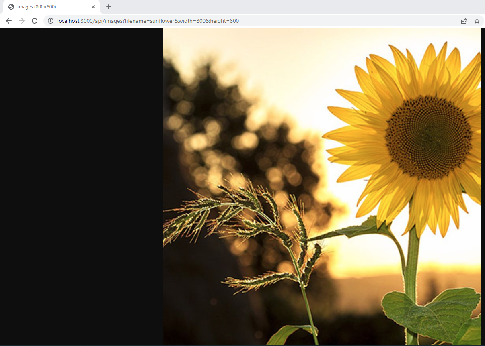
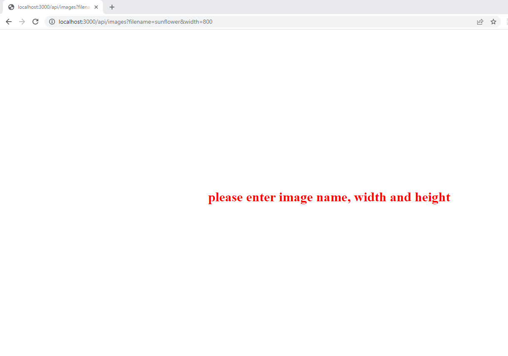
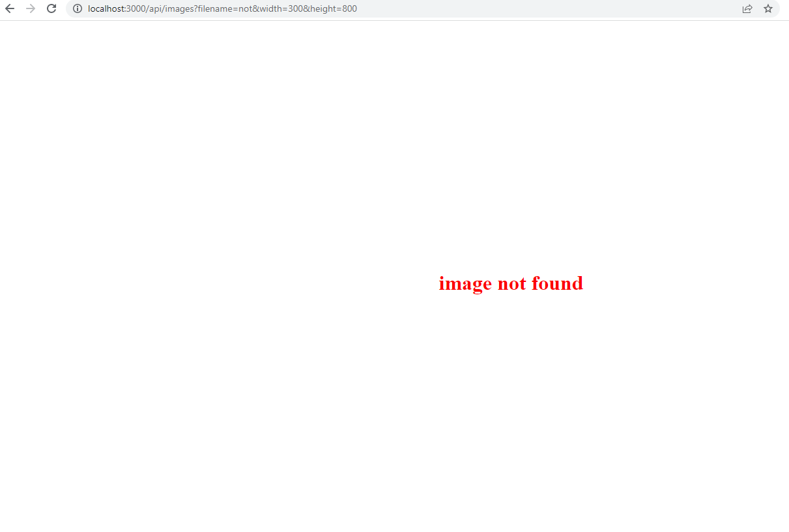
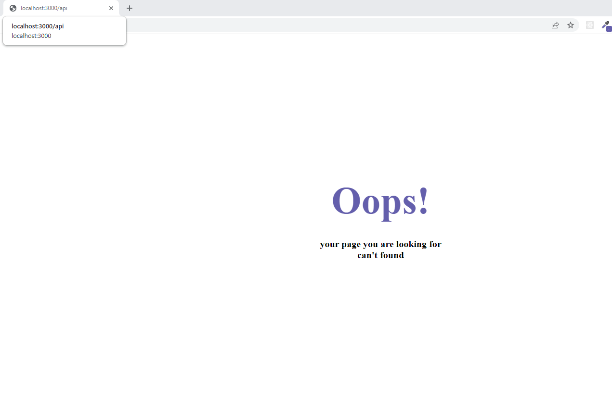

## resize image API

- you can use app's endpoint for resizing image
- customize width and height as you like
- create thump

## Usage

by

- installing app's dependency
  ```shell
    npm install
  ```
- start dev server by using
  ```shell
    npm run dev
  ```
- visiting images endpoint and providing valid prams

  # Example

  `http://localhost:3000/api/images?filename=sunflower&width=300&height=800`
  ``

  ## 

## Scripts

1- to build the app

```shell
    npm run build
```

2- to start development server

```shell
    npm run dev
```

3- to test the app

```shell
    npm run test
```

## Endpoints

- `http://localhost:3000/` => home page with welcome message
- `http://localhost:3000/api/images?filename={image-name}&width={image-width}&height={image-height}`=> create thumbs from images
  by providing name , width and height of the image.

---

## Error Handling

- images endpoint
  - when one of prams is missing server will redirect to error page with status code 422
    with custom messages
    
  - if all prams provided and image doesn't exist server will redirect to error page with status code 404
    with custom message
    
  - if you provided api url not exist server will redirect to error page with status code 404
    with custom message
    

---
